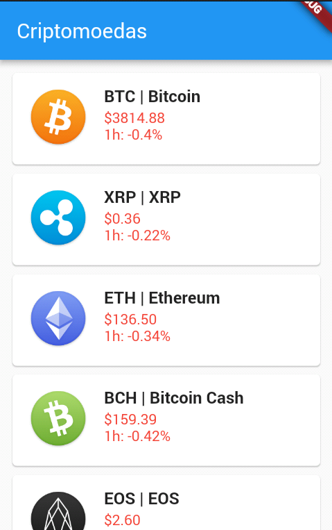

# flutter_criptocurrency

Um aplicativo Flutter que coleta informações sobre valores de criptomoedas
usando a [Api: Coinmarketcap](https://api.coinmarketcap.com/v1/ticker/).

## Getting Started

This project is a starting point for a Flutter application.

A few resources to get you started if this is your first Flutter project:

- [Lab: Write your first Flutter app](https://flutter.io/docs/get-started/codelab)
- [Cookbook: Useful Flutter samples](https://flutter.io/docs/cookbook)

For help getting started with Flutter, view our 
[online documentation](https://flutter.io/docs), which offers tutorials, 
samples, guidance on mobile development, and a full API reference.
